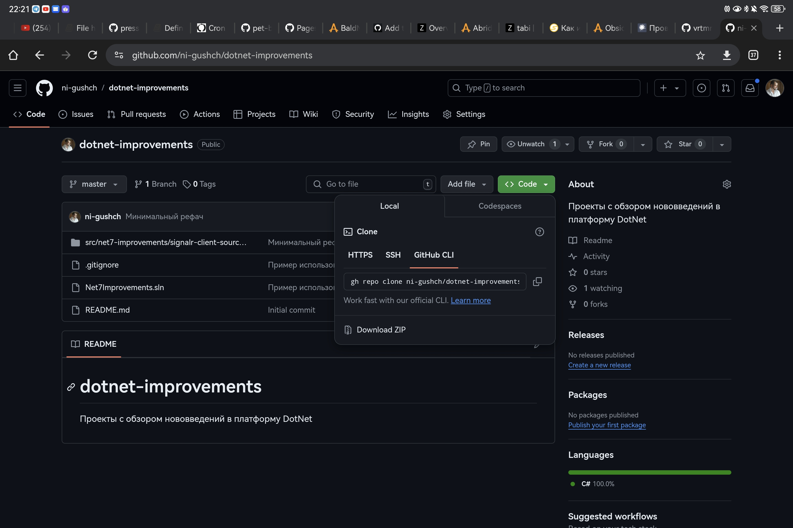
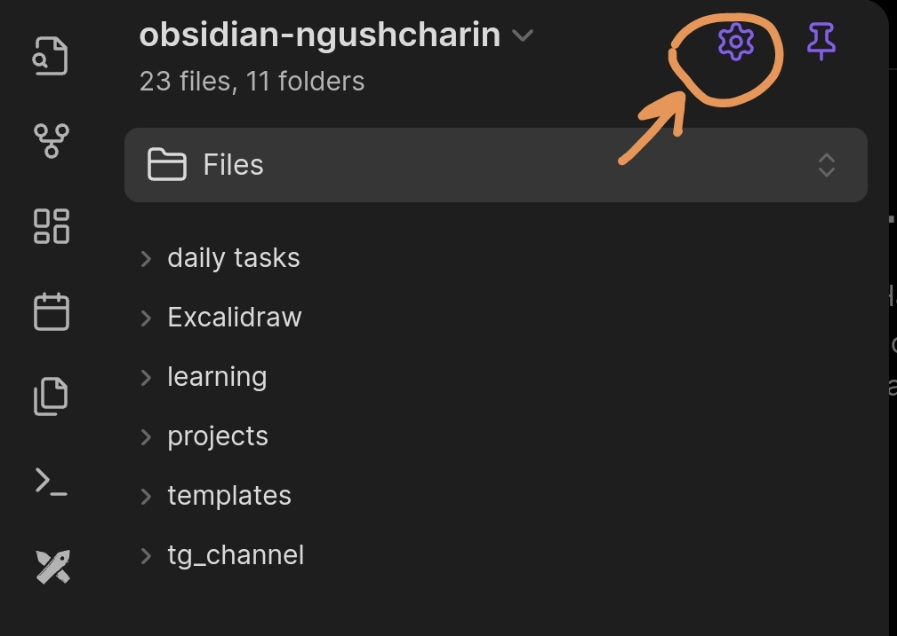
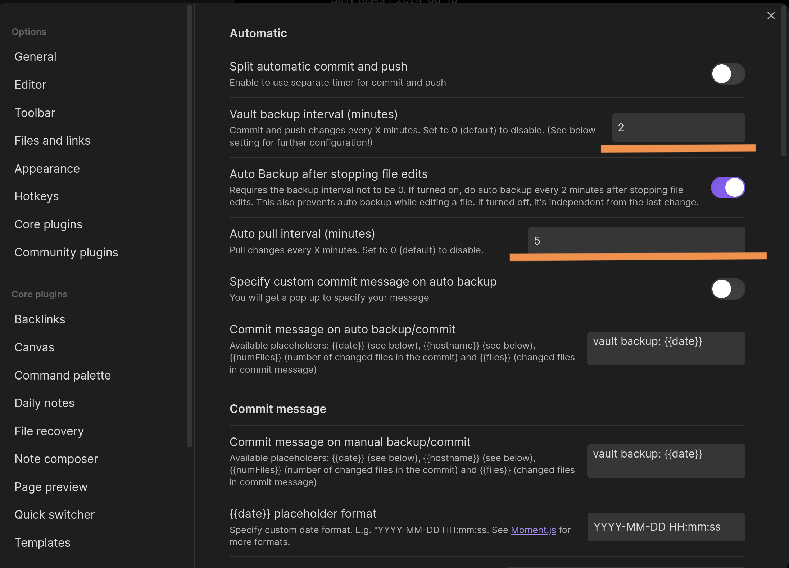

+++
title = "Obsidian. Git синхронизация на Android."
description = "Способы синхронизации хранилищ Obsidian на Android устройствах через Git."
date = 2024-08-18
updated = 2025-02-23
draft = false
in_search_index = true

[taxonomies]
tags = ["obsidian","git",]
[extra]
keywords = "Obsidian, Obsidian Git, Obsidian Sync"
#thumbnail = "ferris-gesture.png"
#toc = true
series = "obsidian"
+++

**Obsidian** — очень удобный инструмент для работы с заметками разного рода. Можно составлять просто список дел на день, а некоторые люди пишут сценарии или наброски книг.

Но при его использовании встаёт вопрос о синхронизации данных. Конечно, можно использовать функционал облака от разработчиков Obsidian, но иногда хочется получить независимость от "корпораций". И **Obsidian** может предоставить такой вариант.

Есть два способа: установить локальный сервер синхронизации, который использует CouchDB, либо можно воспользоваться системой контроля версий Git.

В этой статье пойдёт речь о том, как реализовать синхронизацию хранилища через Git на Android устройствах.

## Подготовительный этап

Для реализации любого способа нам обязательно нужен репозиторий, в котором будут храниться все документы. Для этого заходим туда, где будем создавать репозиторий (GitLab, GitHub...), логинимся и создаём пустой приватный репозиторий. Чтобы автоматически создалась ветка, можно сразу добавить в репозиторий файл `.gitignore`.


Далее нам нужно как-то клонировать этот репозиторий на Android устройство. Так как встроенной поддержки командной строки в Android нет, придётся воспользоваться сторонним приложением, которое будет эмулировать работу командной строки Unix-системы.

### Установка Termux и настройка Git

**Termux** — приложение с открытым исходным кодом, которое предназначено для эмуляции командной строки Linux с поддержкой пакетного менеджера. Скачать это приложение можно как из [Google Play](https://play.google.com/store/apps/details?id=com.termux&hl=ru), так и из альтернативного магазина [F-Droid](https://f-droid.org/packages/com.termux/), в котором содержатся только приложения с открытым исходным кодом. За дополнительной информацией можно обратиться на их официальную [Wiki страничку](https://wiki.termux.com/wiki/Installation).

Теперь запускаем приложение и начинаем устанавливать необходимые пакеты.

```sh
pkg update && pkg upgrade -y && pkg install -y git openssh termux-api
```

Теперь определим, в какой папке будут расположены репозитории Vaults. Для примера создадим папку `repos` в папке `Documents`.

```sh
mkdir ~/storage/shared/Documents/repos \
mkdir ~/storage/shared/Documents/repos/obsidian/
cd ~/storage/shared/Documents/repos/obsidian
```

Теперь нам нужно клонировать репозиторий в созданную папку.

Если бы у нас репозиторий был публичный, проблем бы не было. Но у нас он приватный, и чтобы клонировать его, нужно пройти авторизацию.

Для GitHub можно воспользоваться их фирменным CLI-приложением `gh`. Чтобы его установить, нужно выполнить команду:

```sh
apt install gh
```

Для авторизации на сайте можно использовать:

```sh
gh login
```

Нужно будет выбрать способ прохождения авторизации. Я обычно выбираю через браузер... после выбора параметров вас перебросит в браузер, где нужно будет ввести дополнительно код, сгенерированный в консоли.

После подключения можно будет получить ссылку такого вида:



И, выполнив её в консоли Termux, репозиторий будет клонирован в ту папку, в которой мы сейчас находимся.

```sh
gh repo clone <repo-link>
```

### Добавление хранилища в Obsidian

После клонирования репозитория мы можем добавить эту папку как хранилище в Obsidian.

Если вы только скачали само приложение, на стартовом экране у вас появится кнопка "Выбор папки для хранилища". Нажав её, укажите ту папку, которая была создана в результате клонирования репозитория.

Теперь все добавляемые файлы будут индексироваться `git`, и их можно отправлять в удалённый репозиторий.

С подготовительным этапом закончили. Теперь рассмотрим способы именно синхронизации.

## Использование расширения Git

Самый простой способ. Он работает на любом устройстве, но разработчики пишут, что на мобильных устройствах может работать крайне нестабильно. Потому что расширение не может использовать нативные команды Git CLI, а использует библиотеку JavaScript, которая каким-то образом тоже умеет работать с Git.

У меня получилось запустить его не с первого раза. Но после удачной попытки настроить синхронизацию через командную строку, расширение заработало. Я думаю, что это было просто совпадение. Давайте пройдём по шагам.

### Установка расширения

Плагин разрабатывается сообществом, и поэтому его нет в составе `CorePlugins`. Нужно сначала включить поддержку `Community plugins`. Для этого нажмите на шестерёнку в правом верхнем углу меню.



После включаем поддержку `Community plugins`, как показано на рисунке.


Далее нажимаем на просмотр списка доступных расширений.


И ищем среди списка расширение с названием `Git`.


Нажимаем на это расширение -> Установить -> Активировать. Кнопка активировать будет там, где на картинке кнопка "отключить".


Далее переходим в настройки плагина. Я установил время автоматического обновления репозитория: коммит изменений каждые 2 минуты, проверка обновлений каждые 5 минут. Так как мы всё-таки работаем одновременно на одном устройстве, не обязательно делать мгновенное обновление.



Включаем проверку обновления при старте приложения, Push изменений после локальной фиксации и обновление локального репозитория перед отправкой в удалённый (Pull before Push).


Также обязательно нужно ввести свой логин, пароль (Public Access Token для GitHub, его можно получить в настройках пользователя GitHub). А также обязательно вводим имя пользователя и почту для пользователя Git.


Теперь у вас будет автоматически обновляться репозиторий хранилища. Вы можете заметить, что будут автоматически появляться всплывающие окна с описанием действия синхронизации.

## Использование Termux эмулятора

Для реализации этого подхода у нас почти всё готово. Единственное, что нужно сделать, — это прописать имя пользователя и адрес электронной почты, а также настроить SSH-ключ для синхронизации. Заходим в приложение Termux и запускаем команды:

```sh
git config --global user.name <name>
git config --global user.email <email>
```

Чтобы получить SSH-ключ, пропишем в командной строке:

```sh
cat ~/.ssh/id_rsa.pub
```

Скопируйте то, что вывелось в результате команды, идите в настройки пользователя GitHub или другого репозитория и добавьте SSH-ключ авторизации.

Минус этого подхода в том, что тут не будет никакой автоматики, и придётся прописывать все команды вручную. Но зато всё будет точно работать :D

Заходим в папку, где находится наше хранилище:

```sh
cd ~/storage/Documents/repos/obsidian/my-obsidian-vault-repo
```

Обновляем индекс удалённого репозитория:

```sh
git fetch --prune
git pull
```

> Заметка: чтобы постоянно не использовать `prune` для очистки локального индекса, можно использовать глобальную настройку:
>
> ```sh
> git config remote.origin.prune true
> ```

После синхронизации локальной копии с удалённой и добавления новых файлов можно отправить эти изменения в удалённый репозиторий. Для этого выполним следующее:

```sh
git add .
git commit -m <message>
git push
```

Вот так вручную можно обновлять данные в удалённом репозитории. Но этот способ не такой удобный. Давайте попробуем его улучшить.

## Использование Termux и отдельного планировщика Tasker

Если вы выполняли пункты, описанные ранее, то можно начать вот [ЭТУ](https://github.com/DovieW/obsidian-android-sync/blob/master/README.md) инструкцию с 7 шага, раздела **Termux Setup**.

Только в нашей ситуации папка, в которую будет клонирован скрипт, будет чуть другой:

```sh
git clone https://github.com/DovieW/obsidian-android-sync.git ~/storage/shared/Documents/repos/obsidian/obsidian-android-sync
```

**Плюс** этого метода — потенциальная автоматизация, если правильно пройти все настройки. Если же не получится поработать с приложением Tasker, то останется скрипт, который можно вызывать для синхронизации хранилища.

```sh
./sync-vaults.sh
```

Этот скрипт автоматически подтянет изменения из удалённого репозитория, сделает коммит и отправит его в удалённый репозиторий.

**Минус** этого подхода — приложение **Tasker** — ПЛАТНОЕ!!! А зачем нам использовать синхронизацию собственными руками, да ещё и платить за приложение? Но если оно уже у вас есть, то этот способ для вас.

## Использование Termux и планировщика cron

Есть ещё один способ, который просто является альтернативой для предыдущего. В этом варианте мы заменяем приложение Tasker на возможности cron scheduler. Запускать и управлять им можно прямо в самом **Termux**.

Для реализации такого подхода можно воспользоваться [этой инструкцией](https://www.reddit.com/r/ObsidianMD/comments/qep4gn/guide_obsidian_vault_github_sync_cron_on_termux/). Но в качестве скрипта можно использовать тот, который мы получили в результате предыдущего способа.

С помощью cron можно очень гибко настроить время синхронизации.

На этом всё. Мы рассмотрели несколько способов реализации синхронизации хранилища через Git-репозиторий.

Если остались вопросы, то можно задать их под постами в [tg канале](https://t.me/bald_man_gushcharin).
